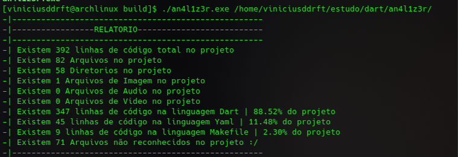

# An4l1z3r  

## feito para analizar seu código de maneira automatizada e te entregar as informações

<h3>O an4l1z3r é uma ferramenta que te da detalhes sobre algum projeto seu.</h3>

<p>exemplo abaixo:</p>



<p>informações que o An4l1z3r fornece</p>
<ul>
<li>Número de linhas de código geral do projeto</li>
<li>Número de arquivos no projeto</li>
<li>Número de diretorios no projeto</li>
<li>Número de imagens usados</li>
<li>Número de sons usados</li>
<li>Número de videos usados</li>
<li>Número de linhas em cada linguagem</li>
<li>Número de arquivos não recinhecidos(arquivos não reconhecidos são arquivos que o an4l1z3r não sabe como classificar exemplo se uma imagem tiver com uma extensão errada .pmg esse arquivo sera dado como não reconhecido)</li>
</ul>
<br>
<p>No momento ele reconhece poucos tipos de arquivos no seu projeto, mas em breve será adicionado mais ;)</p>

<br>

## como usar

<p> primeiramente você precisa do dart instalado, não vou entrar em como fazer isso, partindo dai existem 2 opções compilar o an4l1z3r ou executar pelo prorio dart.</p>

<hr>

### Compilação

```bash
make
```

<p>existe um Makefile que fara tudo para você basta rodar esse comando, ele vai gerar um
diretorio build com o an4l1z3r.exe dentro e basta usar ele da seguinte forma</p>

```bash
./an4l1z3r.exe pathYourFolder
```

<hr>

### Diretamente pelo Dart

<p>Nesse passo basta executar o comando a baixo</p>

```bash
dart run an4l1z3r.dart pathYourFolder
```

<br>

<p>É isso use a vontade e sinta-se a vontade para contribuir. ;) </p>
